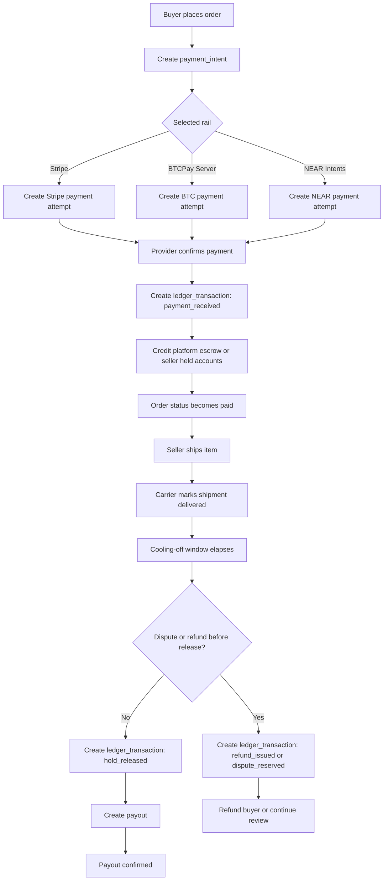

# CMD Market Marketplace Database Design

**Date:** 2026-03-22

## Summary

This document defines the planned PostgreSQL database design for CMD Market as an agent-first, seller-driven marketplace for physical goods. It is the canonical planning artifact until a backend exists in this repository.

The design assumes:

- BetterAuth is the identity baseline.
- Humans are the primary identities.
- Seller stores are commerce roots.
- Agents authenticate with seller-scoped API keys and act on behalf of a seller store.
- CMD Market runs native marketplace transactions with held funds, payouts, refunds, and disputes.

## Source Of Truth Recommendation

For this repository today, the best place to save database design work is `docs/plans/active/` because the backend and schema do not exist yet. This keeps the document honest: it is a serious design artifact, but it is not runtime truth yet.

Recommended lifecycle:

1. Keep the working schema design here at `docs/plans/active/2026-03-22-marketplace-database-design.md`.
2. Use this file as the canonical planning document while backend work is still future work.
3. Once the database is implemented or the design stabilizes, promote the durable truth into a focused doc such as `docs/database.md` and link it from `docs/index.md`.

Markdown with embedded Mermaid diagrams is the canonical format. It is easy to diff, easy to review, easy for agents to parse, and gives us built-in illustrations without needing a second source of truth.

## Goals

- Support BetterAuth-native identity and seller/store memberships.
- Model seller eligibility using Twitter/X reputation as listing collateral.
- Support flat categories with category-scoped structured facets.
- Support fixed-price listings only.
- Support native checkout, shipping, held funds, payouts, refunds, and disputes.
- Preserve light provenance and auditability for agent-created writes.
- Stay narrow on v1 scope by explicitly excluding auctions, native buyer-seller messaging, KYC-first onboarding, and a full AI draft pipeline.

## Design Principles

### 1. BetterAuth owns identity

BetterAuth tables remain the source of truth for auth identity and session state:

- `user`
- `session`
- `account`
- `verification`
- `organization`
- `member`
- `invitation`
- `apikey`

We do not replace those tables with marketplace-specific versions.

### 2. Seller stores are commerce roots

Commerce records should not hang directly off BetterAuth users. Listings, balances, payout settings, and policy state belong to a dedicated `seller_account` that is linked 1:1 with a BetterAuth `organization`.

This gives us:

- one marketplace root for ownership and balances
- clean seller-scoped agent credentials
- future room for richer seller-account collaboration if the product earns it later
- separation between auth concerns and commerce concerns

### 3. Agent access is seller-scoped

Agents authenticate with BetterAuth API keys configured with `references: "organization"`. In CMD Market terms, the organization is the auth-side representation of the seller store.

Agent actions should still be attributable in marketplace tables and audit logs. We want to know whether a mutation came from:

- a human session
- a seller-scoped API key
- a system/admin process

### 4. Flat categories, structured facets

CMD Market should not recreate eBay's deep taxonomy. The catalog model uses:

- a flat category list
- category-scoped attribute definitions
- typed listing attribute values

This avoids a deep tree while still giving agents and filters structured inventory.

### 5. Money is stored as exact atomic units

Do not store money as floating point values.

Use:

- fiat display prices in minor units, such as cents
- settlement and ledger amounts in atomic units per asset
- explicit asset or currency codes on all monetary records

This matters because the marketplace may price an item in one display currency while settling it through Stripe, BTC, or NEAR-based rails.

### 6. Object storage uses DigitalOcean Spaces

Seller profile assets and listing media should live in DigitalOcean Spaces.

Spaces-specific assumptions:

- Spaces is treated as S3-compatible object storage
- the database stores stable object keys, not presigned upload URLs
- public asset URLs are derived at read time from a CDN or custom asset host in front of Spaces
- upload lifecycle belongs in the API and storage layer, not in extra provider-specific database tables for v1

### 7. Light provenance, not a full AI pipeline

We need enough auditability to know who or what wrote important records, but we do not need separate tables for model runs, extraction runs, or draft-run lineage yet.

The design should prefer:

- explicit actor references on key marketplace records
- `audit_event` for historical traceability

## Naming And ID Conventions

- Keep BetterAuth table names exactly as BetterAuth defines them.
- Use singular snake_case names for custom marketplace tables.
- Use UUIDv7 for custom marketplace primary keys.
- Use text foreign keys when referencing BetterAuth-owned IDs so they match BetterAuth's chosen ID type.
- Include `created_at` and `updated_at` on nearly all custom tables.
- Use `deleted_at` only where soft delete materially improves recovery or auditability.

## Auth Boundary

### BetterAuth Core Tables

- `user`: human identity root
- `session`: browser or session-based auth
- `account`: external login providers
- `verification`: verification tokens and flows

### BetterAuth Organization Tables

- `organization`: auth-side representation of a seller store
- `member`: membership and role assignment inside the store
- `invitation`: store invitations

Defer BetterAuth's optional `team` and `teamMember` tables. Organization membership is enough for v1.

### BetterAuth API Key Table

Use the BetterAuth API key plugin with organization references so seller-scoped tokens map cleanly onto store ownership.

Recommended configuration assumption:

- `references: "organization"`
- API key permissions stored in plugin-supported permissions or metadata
- rate limits enabled per key

### Custom Audit Table

Add one marketplace-owned audit table:

#### `audit_event`

Purpose:

- preserve a durable trail of important seller, listing, order, payment, payout, and dispute mutations

Key fields:

- `id`
- `entity_table`
- `entity_id`
- `action`
- `actor_type` (`user`, `api_key`, `system`, `admin`)
- `actor_user_id` nullable
- `actor_api_key_id` nullable
- `seller_account_id` nullable
- `metadata_json`
- `created_at`

## Seller And Trust Model

### `seller_account`

Purpose:

- commerce root for a seller store

Key fields:

- `id`
- `organization_id` unique FK -> `organization.id`
- `status` (`active`, `suspended`, `closed`)
- `listing_eligibility_status` (`pending`, `eligible`, `revoked`, `suspended`)
- `listing_eligibility_source` (`x_verification`, `manual_override`)
- `listing_eligibility_note` nullable
- `default_display_currency_code`
- `created_at`
- `updated_at`

Notes:

- Listings, balances, payout methods, and seller policy should reference `seller_account.id`.
- This is the root boundary for permissions and reconciliation.
- `listing_eligibility_source` makes it explicit whether the seller is eligible because of Twitter/X verification or the manual override path.

### `seller_profile`

Purpose:

- public-facing seller/store metadata

Key fields:

- `seller_account_id` unique FK
- `display_name`
- `slug` unique
- `bio`
- `avatar_asset_key`
- `banner_asset_key`
- `created_at`
- `updated_at`

Notes:

- `avatar_asset_key` and `banner_asset_key` are DigitalOcean Spaces object keys, not public URLs.
- Public URLs should be derived at read time from the configured asset host.

### `seller_policy`

Purpose:

- store-specific marketplace behavior defaults

Key fields:

- `seller_account_id` unique FK
- `handling_time_days`
- `return_window_days`
- `payout_hold_days`
- `created_at`
- `updated_at`

### `seller_social_verification`

Purpose:

- record the Twitter/X-based listing gate

Key fields:

- `id`
- `seller_account_id` FK
- `platform` (`x`)
- `external_account_id`
- `handle`
- `follower_count_snapshot`
- `required_threshold_snapshot`
- `status` (`pending`, `verified`, `revoked`, `failed`, `expired`)
- `verified_at`
- `expires_at` nullable
- `revoked_at` nullable
- `raw_payload_json`
- `created_at`
- `updated_at`

Notes:

- At most one active verified record per seller and platform should exist at a time.
- The follower count snapshot is important because policy can change later.
- Eligibility is normally granted through a verified Twitter/X record; manual approval should update `seller_account.listing_eligibility_*` without requiring a fake social verification row.

### `seller_payout_method`

Purpose:

- seller destination for payout releases

Key fields:

- `id`
- `seller_account_id` FK
- `rail` (`stripe`, `btcpay`, `near_intents`)
- `network`
- `destination_reference`
- `destination_label`
- `status` (`active`, `disabled`, `pending`)
- `is_default`
- `metadata_json`
- `created_at`
- `updated_at`

## Catalog And Discovery Model

### `category`

Purpose:

- flat top-level classification for listings

Key fields:

- `id`
- `slug` unique
- `name`
- `description`
- `sort_order`
- `is_active`
- `created_at`
- `updated_at`

Notes:

- No parent-child tree in v1.
- If a deeper taxonomy is ever needed later, add it deliberately rather than leaving a dormant hierarchy now.

### `attribute_definition`

Purpose:

- typed facet definition reusable across categories

Key fields:

- `id`
- `key` unique
- `label`
- `value_type` (`text`, `number`, `boolean`, `enum`, `json`)
- `unit_label` nullable
- `configuration_json`
- `created_at`
- `updated_at`

### `category_attribute`

Purpose:

- category-scoped enablement and rules for an attribute

Key fields:

- `id`
- `category_id` FK
- `attribute_definition_id` FK
- `is_required`
- `is_filterable`
- `is_sortable`
- `sort_order`
- `allowed_values_json` nullable
- `created_at`
- `updated_at`

Notes:

- Unique on (`category_id`, `attribute_definition_id`)
- This is how we avoid uncontrolled EAV while still supporting flexible structured inventory.

### `listing`

Purpose:

- public marketplace listing for a physical item

Key fields:

- `id`
- `seller_account_id` FK
- `category_id` FK
- `title`
- `description`
- `condition_code`
- `quantity_available`
- `unit_price_minor`
- `display_currency_code`
- `status` (`draft`, `published`, `reserved`, `sold`, `cancelled`, `expired`)
- `published_at` nullable
- `closed_at` nullable
- `created_by_user_id` nullable FK -> `user.id`
- `created_by_api_key_id` nullable FK -> `apikey.id`
- `updated_by_user_id` nullable FK -> `user.id`
- `updated_by_api_key_id` nullable FK -> `apikey.id`
- `created_at`
- `updated_at`

Notes:

- Listings are mostly one-off physical goods, but `quantity_available > 1` is allowed.
- No auction-specific fields belong here in v1.

### `listing_media`

Purpose:

- ordered media assets for a listing

Key fields:

- `id`
- `listing_id` FK
- `asset_key`
- `asset_type`
- `alt_text`
- `sort_order`
- `created_at`

Notes:

- `asset_key` is the canonical DigitalOcean Spaces object key for the asset.
- Do not persist presigned upload URLs in marketplace tables.
- Public media URLs should be derived from `asset_key` through the configured CDN or asset host.

### `listing_attribute_value`

Purpose:

- typed structured attributes attached to a listing

Key fields:

- `id`
- `listing_id` FK
- `category_attribute_id` FK
- `value_text` nullable
- `value_number` nullable
- `value_boolean` nullable
- `value_json` nullable
- `normalized_text` nullable
- `created_at`
- `updated_at`

Notes:

- Unique on (`listing_id`, `category_attribute_id`)
- Only one value column should be populated according to the mapped attribute type.

### `listing_reservation`

Purpose:

- temporary quantity hold to prevent oversell during in-flight checkout

Key fields:

- `id`
- `listing_id` FK
- `order_id` nullable FK
- `quantity`
- `status` (`active`, `released`, `consumed`, `expired`)
- `expires_at`
- `created_at`
- `updated_at`

## Order Flow

### `order`

Purpose:

- marketplace transaction root between one buyer and one seller

Key fields:

- `id`
- `seller_account_id` FK
- `buyer_user_id` FK -> `user.id`
- `status` (`pending_payment`, `paid`, `fulfillment_pending`, `shipped`, `delivered`, `completed`, `refunded`, `disputed`, `cancelled`)
- `display_currency_code`
- `subtotal_minor`
- `shipping_minor`
- `platform_fee_minor`
- `total_minor`
- `selected_payment_rail`
- `placed_at`
- `completed_at` nullable
- `cancelled_at` nullable
- `created_at`
- `updated_at`

Notes:

- Keep orders seller-scoped. Multi-seller carts are out of scope for v1.

### `order_item`

Purpose:

- immutable purchase snapshot for items in an order

Key fields:

- `id`
- `order_id` FK
- `listing_id` nullable FK
- `quantity`
- `unit_price_minor`
- `display_currency_code`
- `title_snapshot`
- `description_snapshot`
- `condition_snapshot`
- `attribute_snapshot_json`
- `media_snapshot_json`
- `created_at`

Notes:

- Even if the original listing changes later, the order item snapshot must stay stable for support, refunds, and disputes.

### `order_shipping_address`

Purpose:

- immutable shipping destination snapshot

Key fields:

- `order_id` unique FK
- `recipient_name`
- `line_1`
- `line_2`
- `city`
- `region`
- `postal_code`
- `country_code`
- `phone_number`
- `created_at`

## Payment And Ledger Model

### `payment_intent`

Purpose:

- buyer-facing payment object for an order

Key fields:

- `id`
- `order_id` FK
- `rail` (`stripe`, `btcpay`, `near_intents`)
- `status` (`created`, `pending`, `confirmed`, `failed`, `expired`, `cancelled`, `refunded`)
- `display_currency_code`
- `display_amount_minor`
- `settlement_asset_code`
- `settlement_amount_atomic`
- `settlement_asset_decimals`
- `quote_metadata_json`
- `external_reference`
- `expires_at`
- `created_at`
- `updated_at`

Notes:

- An order may have multiple payment intents over time, but only one should be active at a time.
- This table is where display pricing and rail-specific settlement amounts meet.

### `payment_attempt`

Purpose:

- provider-specific attempt or observation under a payment intent

Key fields:

- `id`
- `payment_intent_id` FK
- `provider_reference`
- `status` (`created`, `submitted`, `observed`, `settled`, `failed`, `expired`)
- `raw_payload_json`
- `observed_at` nullable
- `created_at`
- `updated_at`

### `ledger_account`

Purpose:

- balance bucket for marketplace money state

Key fields:

- `id`
- `owner_type` (`platform`, `seller_account`, `order`, `refund`, `fee`)
- `owner_id`
- `purpose` (`seller_available`, `seller_held`, `platform_escrow`, `platform_fee`, `refund_liability`)
- `asset_code`
- `asset_decimals`
- `status` (`active`, `closed`)
- `created_at`
- `updated_at`

Notes:

- A seller should typically have separate held and available accounts per asset.

### `ledger_transaction`

Purpose:

- balanced financial event header

Key fields:

- `id`
- `type` (`payment_received`, `hold_created`, `hold_released`, `fee_assessed`, `refund_issued`, `payout_sent`, `dispute_reserved`, `dispute_released`)
- `order_id` nullable FK
- `payment_intent_id` nullable FK
- `external_reference` nullable
- `created_at`

### `ledger_entry`

Purpose:

- individual debit or credit line inside a ledger transaction

Key fields:

- `id`
- `ledger_transaction_id` FK
- `ledger_account_id` FK
- `direction` (`debit`, `credit`)
- `amount_atomic`
- `asset_code`
- `entry_index`
- `created_at`

Notes:

- Every `ledger_transaction` must balance exactly per asset.

### `payout`

Purpose:

- release of seller funds from held to destination

Key fields:

- `id`
- `seller_account_id` FK
- `seller_payout_method_id` FK
- `ledger_transaction_id` nullable FK
- `asset_code`
- `amount_atomic`
- `status` (`queued`, `submitted`, `confirmed`, `failed`, `reversed`)
- `external_reference`
- `released_at` nullable
- `created_at`
- `updated_at`

## Fulfillment, Refund, And Dispute Model

### `shipment`

Purpose:

- shipping and delivery state for an order

Key fields:

- `id`
- `order_id` unique FK
- `carrier`
- `service_level`
- `tracking_number`
- `status` (`pending`, `label_created`, `shipped`, `delivered`, `returned`, `lost`)
- `shipped_at` nullable
- `delivered_at` nullable
- `last_tracking_at` nullable
- `tracking_payload_json` nullable
- `created_at`
- `updated_at`

### `refund`

Purpose:

- monetary refund associated with an order or payment

Key fields:

- `id`
- `order_id` FK
- `payment_intent_id` nullable FK
- `asset_code`
- `amount_atomic`
- `reason_code`
- `status` (`requested`, `approved`, `submitted`, `confirmed`, `failed`, `cancelled`)
- `created_at`
- `updated_at`

### `dispute`

Purpose:

- support and financial review record for contested orders

Key fields:

- `id`
- `order_id` FK
- `payment_intent_id` nullable FK
- `opened_by_user_id` nullable FK -> `user.id`
- `status` (`open`, `under_review`, `resolved_buyer`, `resolved_seller`, `cancelled`)
- `reason_code`
- `resolution_summary`
- `opened_at`
- `closed_at` nullable
- `created_at`
- `updated_at`

### `seller_feedback`

Purpose:

- buyer-to-seller reputation record for a completed order

Key fields:

- `id`
- `order_id` unique FK
- `seller_account_id` FK
- `buyer_user_id` FK -> `user.id`
- `rating` smallint
- `comment` nullable
- `status` (`published`, `hidden`, `removed`)
- `created_at`
- `updated_at`

Notes:

- Only one buyer feedback record should exist per completed order.
- This table is intentionally one-way: buyers rate sellers, not the reverse.

## Domain Relationships

The key ownership chain is:

- `user` joins `organization` through `member`
- `organization` maps 1:1 to `seller_account`
- `seller_account` owns listings, payout methods, policy, social verification, orders as seller, and seller-side balances
- `apikey` belongs to `organization`, and therefore acts within one seller boundary
- `listing` belongs to `seller_account`
- `order` connects buyer `user` to seller `seller_account`
- `payment_intent`, `shipment`, `refund`, and `dispute` all attach to an `order`
- `seller_feedback` ties a completed `order` back to the seller reputation surface
- `ledger_transaction` and `ledger_entry` tie money movement back to order and payment context

## Mermaid ERD

```mermaid
erDiagram
    user ||--o{ member : joins
    organization ||--o{ member : has
    organization ||--o{ invitation : issues
    organization ||--o{ apikey : owns
    organization ||--|| seller_account : maps_to
    seller_account ||--|| seller_profile : exposes
    seller_account ||--|| seller_policy : configures
    seller_account ||--o{ seller_social_verification : verifies
    seller_account ||--o{ seller_payout_method : pays_out_to
    seller_account ||--o{ listing : owns
    category ||--o{ category_attribute : enables
    attribute_definition ||--o{ category_attribute : defines
    listing ||--o{ listing_media : contains
    listing ||--o{ listing_attribute_value : describes
    category_attribute ||--o{ listing_attribute_value : constrains
    listing ||--o{ listing_reservation : reserves
    seller_account ||--o{ order : sells_to
    user ||--o{ order : places
    order ||--|{ order_item : contains
    order ||--|| order_shipping_address : ships_to
    order ||--o{ payment_intent : pays_with
    payment_intent ||--o{ payment_attempt : attempts
    order ||--o| shipment : fulfills
    order ||--o{ refund : refunds
    order ||--o{ dispute : disputes
    order ||--o| seller_feedback : yields
    seller_account ||--o{ seller_feedback : receives
    user ||--o{ seller_feedback : leaves
    seller_account ||--o{ audit_event : affects
    order ||--o{ ledger_transaction : references
    payment_intent ||--o{ ledger_transaction : references
    ledger_transaction ||--|{ ledger_entry : contains
    ledger_account ||--o{ ledger_entry : posts_to
    seller_account ||--o{ payout : receives
    seller_payout_method ||--o{ payout : routes

    user {
        text id PK
        text email
        boolean emailVerified
    }

    organization {
        text id PK
        text name
        text slug
    }

    apikey {
        text id PK
        text referenceId
        text name
        boolean enabled
    }

    seller_account {
        uuid id PK
        text organization_id FK
        text status
        text listing_eligibility_status
        text listing_eligibility_source
    }

    seller_social_verification {
        uuid id PK
        uuid seller_account_id FK
        text platform
        text handle
        bigint follower_count_snapshot
        text status
    }

    category {
        uuid id PK
        text slug
        text name
    }

    attribute_definition {
        uuid id PK
        text key
        text value_type
    }

    category_attribute {
        uuid id PK
        uuid category_id FK
        uuid attribute_definition_id FK
        boolean is_required
    }

    listing {
        uuid id PK
        uuid seller_account_id FK
        uuid category_id FK
        text title
        bigint unit_price_minor
        int quantity_available
        text status
    }

    order {
        uuid id PK
        uuid seller_account_id FK
        text buyer_user_id FK
        bigint total_minor
        text selected_payment_rail
        text status
    }

    payment_intent {
        uuid id PK
        uuid order_id FK
        text rail
        text settlement_asset_code
        numeric settlement_amount_atomic
        text status
    }

    ledger_account {
        uuid id PK
        text owner_type
        text purpose
        text asset_code
    }

    ledger_transaction {
        uuid id PK
        text type
        uuid order_id FK
        uuid payment_intent_id FK
    }

    payout {
        uuid id PK
        uuid seller_account_id FK
        uuid seller_payout_method_id FK
        text asset_code
        numeric amount_atomic
        text status
    }

    seller_feedback {
        uuid id PK
        uuid order_id FK
        uuid seller_account_id FK
        text buyer_user_id FK
        smallint rating
        text status
    }
```



## Listing, Order, Payment, And Payout States

```mermaid
stateDiagram-v2
    [*] --> ListingDraft

    ListingDraft --> ListingPublished: publish
    ListingPublished --> ListingReserved: reservation created
    ListingReserved --> ListingPublished: reservation released
    ListingReserved --> ListingSold: order paid
    ListingPublished --> ListingCancelled: seller/admin cancel
    ListingPublished --> ListingExpired: expiration policy

    ListingSold --> [*]
    ListingCancelled --> [*]
    ListingExpired --> [*]

    --

    state "Order Lifecycle" as OrderLifecycle {
        [*] --> PendingPayment
        PendingPayment --> Paid: payment_intent confirmed
        PendingPayment --> Cancelled: timeout or manual cancel
        Paid --> FulfillmentPending: hold created
        FulfillmentPending --> Shipped: shipment confirmed
        Shipped --> Delivered: carrier delivery
        Delivered --> Completed: review window closes and payout released
        Paid --> Refunded: refund before shipment
        FulfillmentPending --> Disputed: issue opened
        Shipped --> Disputed: issue opened
        Delivered --> Disputed: issue opened
        Disputed --> Completed: seller wins
        Disputed --> Refunded: buyer wins
    }

    --

    state "Payout Lifecycle" as PayoutLifecycle {
        [*] --> Held
        Held --> Eligible: shipment and policy conditions satisfied
        Eligible --> Released: payout submitted and confirmed
        Held --> Reversed: refund or dispute before release
        Released --> Reversed: recovery or post-release adjustment
    }
```

## Payment And Settlement Flow



## Indexing And Constraint Strategy

### Core constraints

- Unique `seller_account.organization_id`
- Unique `seller_profile.slug`
- Unique active `seller_social_verification` per seller and platform
- Unique (`category_id`, `attribute_definition_id`) on `category_attribute`
- Unique (`listing_id`, `category_attribute_id`) on `listing_attribute_value`
- Unique active shipment per order
- Balanced `ledger_entry` totals per `ledger_transaction` and asset

### Core indexes

- `listing (seller_account_id, status, published_at desc)`
- `listing (category_id, status, published_at desc)`
- `order (seller_account_id, status, created_at desc)`
- `order (buyer_user_id, status, created_at desc)`
- `payment_intent (order_id, status, created_at desc)`
- `payment_attempt (provider_reference)`
- `seller_social_verification (seller_account_id, platform, status)`
- `ledger_entry (ledger_account_id, created_at desc)`
- `audit_event (entity_table, entity_id, created_at desc)`
- `audit_event (seller_account_id, created_at desc)`

### Search and filtering notes

- Keep category and seller lookups indexed by slug.
- Add partial indexes for published listings only if listing volume justifies it.
- Prefer structured facet indexes on high-value category attributes instead of a generic index-everything approach.

## Validation Scenarios

Future implementation should be considered correct only if the schema supports these scenarios cleanly:

1. A human joins a seller organization, and that organization maps to exactly one `seller_account`.
2. A seller-scoped API key can create or update listings only inside its own seller boundary.
3. A seller cannot publish a listing until seller eligibility is granted by either verified `seller_social_verification` or the manual approval override path on `seller_account`.
4. A listing can carry category-specific typed attributes without turning into a free-form EAV blob.
5. Concurrent checkouts cannot oversell quantity because `listing_reservation` captures temporary holds.
6. An order can move from placed to paid to shipped to completed while held funds release only after carrier delivery and the cooling-off policy are satisfied.
7. A refund or dispute can interrupt payout release and create correct ledger side effects.
8. Stripe, BTCPay Server, and NEAR Intents can all be recorded without collapsing rail-specific data into the core order table.
9. Only buyers with completed orders can leave one feedback record per order, and seller reputation can be read without exposing buyer private data.

## Deferred Scope

Explicitly not modeled in this design:

- auctions
- native buyer-seller messaging
- KYC-before-listing onboarding
- full AI extraction or draft-run provenance tables
- BetterAuth team tables
- multi-seller carts

## References

- BetterAuth Database: https://better-auth.com/docs/concepts/database
- BetterAuth Organization plugin: https://better-auth.com/docs/plugins/organization
- BetterAuth API Key plugin: https://better-auth.com/docs/plugins/api-key
- BetterAuth API Key plugin reference: https://better-auth.com/docs/plugins/api-key/reference
