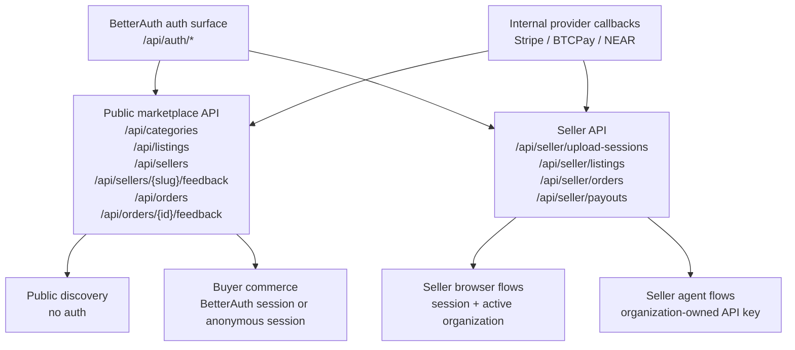
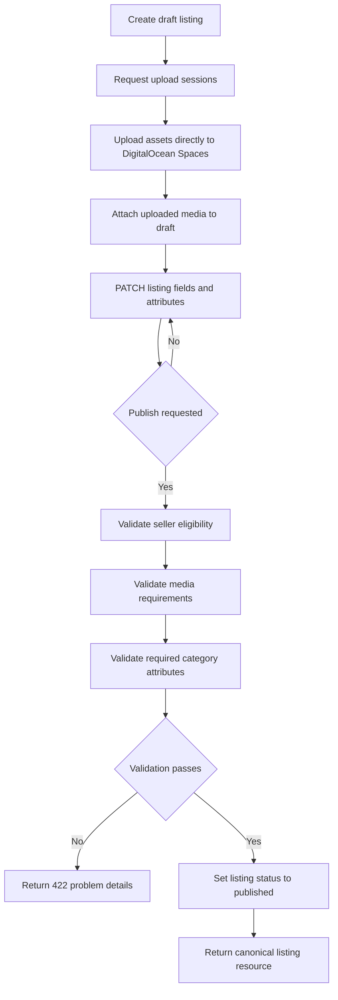
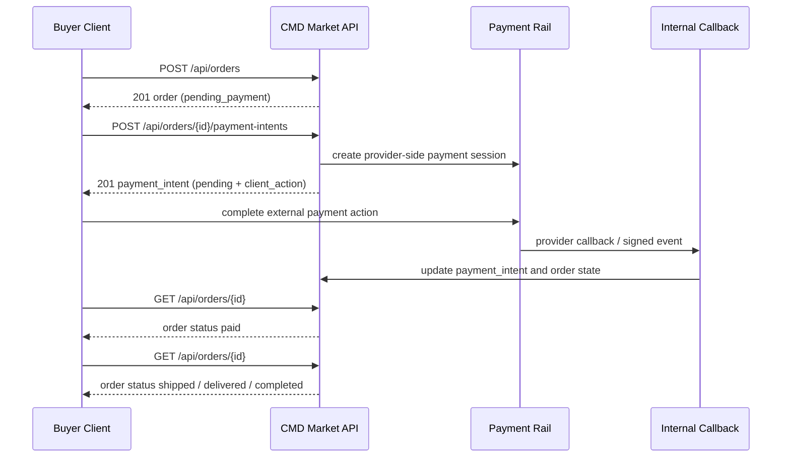

# CMD Market Marketplace API Design

**Date:** 2026-03-25

## Summary

This document defines the planned API design for CMD Market as an agent-first marketplace for physical goods. It is the canonical API planning artifact until a backend exists in this repository.

The design assumes:

- the current runtime host is the Next.js app in `apps/web`
- the database design in `docs/plans/active/2026-03-22-marketplace-database-design.md` is the persistence baseline
- BetterAuth owns identity, sessions, organizations, anonymous users, and API keys
- public discovery is open
- write operations require either a BetterAuth session or a seller-scoped BetterAuth API key

## Source Of Truth Recommendation

For this repository today, the right place for the API design is `docs/plans/active/` because the API is still future work and there is no backend implementation yet.

Recommended lifecycle:

1. Keep the working API design here at `docs/plans/active/2026-03-25-marketplace-api-design.md`.
2. Keep this document paired with the active database design while backend work does not yet exist.
3. Once the API contract is implemented or stabilized, promote the durable truth into a focused doc such as `docs/api.md` and link it from `docs/index.md`.

Markdown is the canonical format. Mermaid diagrams live directly in the document so the API design stays reviewable, diffable, and easy for both humans and agents to consume.

## Goals

- define a single JSON HTTP API shape that works for the web app and agent clients
- support public listing discovery and authenticated marketplace operations
- support BetterAuth sessions for humans, anonymous BetterAuth sessions for guest buyers, and seller-scoped BetterAuth API keys for seller agents
- keep the contract resource-oriented, not RPC-style
- support draft-first listing creation with DigitalOcean Spaces-backed media upload sessions
- support async order and payment flows with Stripe, BTCPay Server, and NEAR Intents
- standardize pagination, filtering, idempotency, and error responses

## Design Principles

### 1. One API, one canonical resource model

CMD Market should not have separate public web and agent APIs for the same core resources.

The public API should expose one canonical JSON representation for:

- listings
- sellers
- categories
- orders
- payment intents

The web app and buyer agents should consume the same listing and discovery resources. Seller routes may add management metadata, but the underlying commerce objects should remain structurally consistent.

### 2. Public read, authenticated write

Discovery should be easy to crawl and easy to integrate:

- public listing and seller reads are unauthenticated
- all mutations require authentication
- buyer commerce operations require a BetterAuth session
- seller operations require either a seller-scoped BetterAuth API key or a BetterAuth session with a valid seller organization context

### 3. BetterAuth owns identity and credential lifecycle

This API design does not replace BetterAuth's auth surface.

BetterAuth remains responsible for:

- sign in and sign up
- anonymous sign in
- session management
- account linking
- organization membership
- active organization selection
- organization-owned API key creation and revocation

CMD Market builds marketplace resources on top of that identity surface.

### 4. Seller routes resolve through organization context

For seller browser sessions, the active BetterAuth organization is the seller context.

For seller API keys, the organization referenced by the key is the seller context.

Seller routes should not accept an arbitrary seller identifier that can bypass this boundary. If a session user belongs to multiple organizations and no active organization is set, the API should return a contract-level error instead of guessing.

### 5. Guest checkout still uses authenticated sessions

Guest checkout does not mean unauthenticated commerce requests.

The buyer flow uses BetterAuth anonymous sessions so that:

- checkout mutations still have a stable user identity
- orders remain attached to a real user row
- later account linking can transfer marketplace ownership to a fully registered account through BetterAuth's anonymous account-link flow

This keeps the API cleaner than introducing separate guest tokens or order recovery credentials.

### 6. Draft-first listing creation

Seller listing creation should be explicit and stateful:

1. create a draft
2. create media upload sessions
3. upload assets directly to DigitalOcean Spaces
4. attach media and structured attributes
5. publish with validation

This keeps agent and web clients aligned and makes validation failures obvious.

### 7. Media storage uses DigitalOcean Spaces

Listing media and seller profile assets should live in DigitalOcean Spaces.

API-specific assumptions:

- Spaces is treated as S3-compatible object storage
- upload sessions return presigned S3-compatible upload requests
- the API and database share `asset_key` as the canonical identifier for uploaded objects
- public media URLs can be served from a CDN or custom asset host in front of Spaces

### 8. Payments are asynchronous state machines

Order placement and payment settlement must be modeled as state transitions, not as a synchronous “charge card and finish” call.

The public API should create and expose:

- `order`
- `payment_intent`
- shipment and fulfillment state

Provider callbacks from Stripe, BTCPay Server, and NEAR Intents are internal implementation details. Public clients observe state through polling the order and payment resources.

### 9. Polling first, no outbound client webhooks

The first public API should not include outbound webhooks for clients.

Clients should poll:

- order status
- payment intent status
- shipment status
- payout status for seller tools

Internal provider callbacks still exist, but they are not part of the public contract.

### 10. Unversioned for now, versionable later

The public API stays unversioned for now to keep the first contract light.

Paths should still be shaped so that a future move from:

- `/api/listings`

to:

- `/api/v1/listings`

is a mechanical migration rather than an API redesign.

## API Boundary

### BetterAuth-Owned Surface

The application relies on BetterAuth for auth endpoints. This design treats those routes as an external auth substrate, not as marketplace endpoints to redesign here.

Relevant BetterAuth capabilities:

- core database and session model
- organization membership and active organization
- anonymous sign-in and later account linking
- organization-owned API keys

Recommended mounting convention:

- BetterAuth auth routes under `/api/auth/*`

This document does not restate every BetterAuth route. It documents how CMD Market marketplace routes rely on them.

### Marketplace-Owned Surface

Marketplace routes live under `/api/*` and split into two broad areas:

- public marketplace surface
- seller surface under `/api/seller/*`

Public does not mean every route is unauthenticated. It means the route belongs to the marketplace-facing contract rather than a seller-only namespace.

## Auth Matrix

| Surface | Primary clients | Auth mode | Notes |
| --- | --- | --- | --- |
| `GET /api/categories`, `GET /api/listings`, `GET /api/sellers/*` | web, buyer agents, crawlers | none | public discovery |
| `GET /api/sellers/{slug}/feedback` | web, buyer agents | none | public seller reputation |
| `POST /api/orders/{id}/feedback` | buyers | BetterAuth session | anonymous session allowed when the order is still owned by the anonymous user |
| `POST /api/orders`, `POST /api/orders/{id}/payment-intents` | buyers | BetterAuth session | anonymous session allowed |
| `GET /api/orders`, `GET /api/orders/{id}` | buyers | BetterAuth session | only own orders |
| `/api/seller/*` browser usage | seller humans | BetterAuth session + active organization | seller context required |
| `/api/seller/*` agent usage | seller agents | BetterAuth API key | key resolves seller context |
| internal provider callbacks | Stripe, BTCPay Server, NEAR Intents | provider secret/signature | not public contract |

## URL And Envelope Conventions

### Path conventions

- all marketplace endpoints live under `/api/`
- public contract is unversioned for now
- seller-only operations live under `/api/seller/`
- collection names are plural resource nouns
- state transitions use subordinate action endpoints when a pure PATCH would obscure workflow meaning

Examples:

- `/api/listings`
- `/api/listings/{listing_id}`
- `/api/orders/{order_id}`
- `/api/seller/listings/{listing_id}/publish`

### Media type

- request and response bodies use `application/json`
- direct asset uploads use presigned S3-compatible upload URLs and headers for DigitalOcean Spaces, not CMD Market JSON bodies

### Timestamps

- all timestamps are ISO-8601 UTC strings

### IDs

- all resource IDs are opaque strings
- clients must not infer resource type or chronology from an ID

### Single-resource envelope

```json
{
  "data": {
    "id": "lst_01JQEXAMPLE",
    "object": "listing"
  }
}
```

### List envelope

```json
{
  "data": [
    {
      "id": "lst_01JQEXAMPLE",
      "object": "listing"
    }
  ],
  "page": {
    "next_cursor": "eyJzb3J0IjoicHVibGlzaGVkX2F0IiwiZCI6IjIwMjYtMDMtMjVUMTI6MDA6MDBaIiwiaWQiOiJsc3RfMDFKUUVYQU1QTEUifQ",
    "has_more": true
  }
}
```

### Error envelope

Use Problem Details-style errors with a stable machine code and optional field errors.

```json
{
  "type": "https://cmd.market/problems/listing-validation-failed",
  "title": "Listing validation failed",
  "status": 422,
  "code": "listing_validation_failed",
  "detail": "The listing cannot be published until required category fields are complete.",
  "instance": "/api/seller/listings/lst_01JQEXAMPLE/publish",
  "errors": [
    {
      "field": "attributes.grade",
      "code": "required",
      "message": "Grade is required for this category."
    }
  ]
}
```

## Canonical Resource Shapes

### Listing resource

The listing resource is the core public marketplace object. Public discovery and buyer agents should read the same canonical shape.

Base shape:

```json
{
  "id": "lst_01JQEXAMPLE",
  "object": "listing",
  "status": "published",
  "title": "1999 Charizard Holo PSA 8",
  "description": "Clean slab, no cracks, centered well.",
  "condition_code": "used_good",
  "quantity_available": 1,
  "price": {
    "amount_minor": 125000,
    "currency_code": "USD"
  },
  "category": {
    "id": "cat_cards",
    "slug": "trading-cards",
    "name": "Trading Cards"
  },
  "seller": {
    "id": "sel_01JQSELLER",
    "slug": "scarce-cards",
    "display_name": "Scarce Cards"
  },
  "media": [
    {
      "id": "med_01JQMEDIA",
      "url": "https://cdn.cmd.market/listings/lst_01JQEXAMPLE/front.jpg",
      "alt_text": "Front of PSA slab",
      "sort_order": 0
    }
  ],
  "attributes": [
    {
      "key": "grading_company",
      "label": "Grading Company",
      "value_type": "enum",
      "value": "psa"
    },
    {
      "key": "grade",
      "label": "Grade",
      "value_type": "number",
      "value": 8
    }
  ],
  "published_at": "2026-03-25T14:00:00Z",
  "updated_at": "2026-03-25T14:05:00Z"
}
```

Seller routes may append a `management` object:

```json
{
  "management": {
    "draft_validation": {
      "publishable": false,
      "issues": [
        {
          "field": "media",
          "code": "minimum_items_not_met",
          "message": "At least one image is required."
        }
      ]
    },
    "created_by": {
      "actor_type": "api_key",
      "actor_id": "key_01JQKEY"
    },
    "eligibility": {
      "listing_eligibility_status": "eligible",
      "listing_eligibility_source": "x_verification"
    }
  }
}
```

### Seller resource

Public seller/stores should be exposed as `seller` resources rather than leaking internal `seller_account` naming.

```json
{
  "id": "sel_01JQSELLER",
  "object": "seller",
  "slug": "scarce-cards",
  "display_name": "Scarce Cards",
  "bio": "Pokemon and sports cards.",
  "avatar_url": "https://cdn.cmd.market/sellers/scarce-cards/avatar.jpg",
  "ratings": {
    "average": 4.9,
    "count": 184
  }
}
```

### Seller feedback resource

```json
{
  "id": "sfb_01JQFEEDBACK",
  "object": "seller_feedback",
  "order_id": "ord_01JQORDER",
  "rating": 5,
  "comment": "Fast shipping and exactly as described.",
  "created_at": "2026-03-25T18:10:00Z"
}
```

### Order resource

Orders are buyer-owned in the public surface and seller-owned in the seller surface. Both routes should return the same core order shape.

```json
{
  "id": "ord_01JQORDER",
  "object": "order",
  "status": "pending_payment",
  "buyer_kind": "anonymous",
  "seller": {
    "id": "sel_01JQSELLER",
    "slug": "scarce-cards",
    "display_name": "Scarce Cards"
  },
  "items": [
    {
      "id": "ori_01JQITEM",
      "listing_id": "lst_01JQEXAMPLE",
      "title_snapshot": "1999 Charizard Holo PSA 8",
      "quantity": 1,
      "unit_price_minor": 125000,
      "currency_code": "USD"
    }
  ],
  "totals": {
    "subtotal_minor": 125000,
    "shipping_minor": 1500,
    "platform_fee_minor": 0,
    "total_minor": 126500,
    "currency_code": "USD"
  },
  "payment_status": "pending",
  "shipment_status": "pending",
  "created_at": "2026-03-25T14:20:00Z",
  "updated_at": "2026-03-25T14:20:00Z"
}
```

### Payment intent resource

```json
{
  "id": "pay_01JQPAYMENT",
  "object": "payment_intent",
  "order_id": "ord_01JQORDER",
  "rail": "btcpay",
  "status": "pending",
  "display_amount": {
    "amount_minor": 126500,
    "currency_code": "USD"
  },
  "settlement": {
    "asset_code": "BTC",
    "amount_atomic": "182500",
    "asset_decimals": 8
  },
  "client_action": {
    "type": "redirect",
    "url": "https://btcpay.example/checkout/xyz"
  },
  "expires_at": "2026-03-25T14:35:00Z",
  "created_at": "2026-03-25T14:20:30Z",
  "updated_at": "2026-03-25T14:20:30Z"
}
```

## Namespace And Resource Inventory

## Public Discovery Resources

### `GET /api/categories`

Purpose:

- list active marketplace categories

Supports:

- cursor pagination if needed later
- public access

### `GET /api/categories/{category_slug}`

Purpose:

- fetch a category and its public attribute/filter metadata

### `GET /api/listings`

Purpose:

- browse public listings

Supports:

- public access
- search and filter query params
- cursor pagination
- summary listing resources

### `GET /api/listings/{listing_id}`

Purpose:

- fetch a full public listing resource

Supports:

- public access
- canonical flat domestic shipping summary from the attached seller shipping profile
- optional related includes

### `GET /api/sellers/{seller_slug}`

Purpose:

- fetch a public seller/store profile

### `GET /api/sellers/{seller_slug}/listings`

Purpose:

- list all public listings for a seller/store

### `GET /api/sellers/{seller_slug}/feedback`

Purpose:

- list public buyer-to-seller feedback for a seller/store

## Buyer Commerce Resources

These routes belong to the public marketplace surface but require a BetterAuth session. Anonymous BetterAuth sessions are valid for checkout.

### `POST /api/orders`

Purpose:

- create an order directly from a listing

Auth:

- BetterAuth session required
- anonymous session allowed

Request contract:

- `listing_id` is required
- `quantity` required
- `shipping_address` required
- `shipping_address.country_code` must be `US`
- `shipping_address.region` must be one of the `50 states + DC`
- non-U.S. destinations, territories, and military mail are rejected
- `shipping_minor` is copied directly from the listing's attached flat domestic shipping profile
- no carrier rating call occurs during checkout in this slice
- no cart model

### `GET /api/orders`

Purpose:

- list orders for the current buyer session user

Auth:

- BetterAuth session required

### `GET /api/orders/{order_id}`

Purpose:

- fetch a buyer-owned order

Auth:

- BetterAuth session required

Notes:

- if an anonymous buyer later links a real account, CMD Market must preserve access by moving buyer-owned marketplace records during BetterAuth anonymous account-link handling

### `POST /api/orders/{order_id}/feedback`

Purpose:

- create buyer-to-seller feedback for a completed buyer-owned order

Auth:

- BetterAuth session required

Notes:

- anonymous sessions are allowed if the order is still owned by the anonymous BetterAuth user
- exactly one feedback record may be created per completed order

### `POST /api/orders/{order_id}/payment-intents`

Purpose:

- create a payment intent for a buyer-owned order

Auth:

- BetterAuth session required

Notes:

- async resource creation
- provider settlement happens outside the request-response cycle

### `GET /api/orders/{order_id}/payment-intents`

Purpose:

- list payment intents for a buyer-owned order

Auth:

- BetterAuth session required

## Seller Resources

Seller routes always operate within the resolved seller context.

Context resolution rules:

- session auth uses the active BetterAuth organization
- API key auth uses the organization referenced by the key
- if no active organization exists for a browser seller session, return `409 organization_context_required`

### `POST /api/seller/upload-sessions`

Purpose:

- create direct-to-storage upload sessions for listing media

Auth:

- seller session or seller API key

Notes:

- this endpoint creates presigned S3-compatible upload requests for DigitalOcean Spaces
- the response returns an `asset_key` that matches the object key persisted in marketplace tables

### `GET /api/seller/shipping-profiles`

Purpose:

- list reusable seller-owned flat domestic shipping profiles

Auth:

- seller session or seller API key

### `POST /api/seller/shipping-profiles`

Purpose:

- create a reusable seller-owned flat domestic shipping profile

Auth:

- seller session or seller API key

Notes:

- shipping is currently fixed to `US 50 states + DC`
- `domestic_rate_minor` is stored in `USD` minor units
- `0` means free shipping
- `handling_time_days` is constrained to `1 | 2 | 3`

### `GET /api/seller/shipping-profiles/{shipping_profile_id}`

Purpose:

- fetch one seller-owned shipping profile

Auth:

- seller session or seller API key

### `PATCH /api/seller/shipping-profiles/{shipping_profile_id}`

Purpose:

- update one seller-owned shipping profile

Auth:

- seller session or seller API key

### `POST /api/seller/listings`

Purpose:

- create a listing draft

Auth:

- seller session or seller API key

Notes:

- returns a draft listing resource
- `shipping_profile_id` is optional at create time
- publish validation requires a seller-owned shipping profile before the listing can go live
- no publish occurs here

### `GET /api/seller/listings`

Purpose:

- list all listings owned by the current seller context

Auth:

- seller session or seller API key

### `GET /api/seller/listings/{listing_id}`

Purpose:

- fetch one seller-owned listing with management metadata

Auth:

- seller session or seller API key

Notes:

- includes both `shipping_profile_id` and the normalized `shipping` summary

### `PATCH /api/seller/listings/{listing_id}`

Purpose:

- update draft or unpublished listing fields

Auth:

- seller session or seller API key

Notes:

- accepts `shipping_profile_id` to attach or replace the flat domestic shipping profile on the draft

### `POST /api/seller/listings/{listing_id}/media`

Purpose:

- attach already-uploaded assets to a listing

Auth:

- seller session or seller API key

### `POST /api/seller/listings/{listing_id}/publish`

Purpose:

- validate and publish a draft listing

Auth:

- seller session or seller API key

Notes:

- validates seller eligibility
- seller eligibility may come from verified Twitter/X status or the manual approval override path
- validates required category attributes
- validates media requirements
- returns the updated listing resource or a 422 problem details response

### `POST /api/seller/listings/{listing_id}/unpublish`

Purpose:

- remove a published listing from active discovery without deleting it

Auth:

- seller session or seller API key

### `GET /api/seller/orders`

Purpose:

- list orders belonging to the current seller

Auth:

- seller session or seller API key

### `GET /api/seller/orders/{order_id}`

Purpose:

- fetch one seller-owned order

Auth:

- seller session or seller API key

### `POST /api/seller/orders/{order_id}/shipments`

Purpose:

- create or update shipment details for a seller-owned order

Auth:

- seller session or seller API key

### `GET /api/seller/payouts`

Purpose:

- list payout records for the current seller

Auth:

- seller session or seller API key

## BetterAuth Integration Notes

### Anonymous sessions

Anonymous buyers should use BetterAuth's anonymous plugin. Marketplace endpoints do not need a second guest identity system.

Practical effect:

- a buyer can browse publicly with no session
- the first mutating buyer action can trigger anonymous sign-in if needed
- order ownership attaches to the anonymous BetterAuth user
- when that anonymous user links a real auth method, marketplace-owned buyer resources must be reassigned in BetterAuth's `onLinkAccount` flow because the anonymous user is deleted by default

Minimum migration responsibilities during anonymous account linking:

- transfer buyer-owned orders
- reassign existing `seller_feedback` rows to the linked non-anonymous user when feedback has already been left
- preserve access to buyer-owned feedback rights for eligible completed orders
- preserve access to order history
- preserve authorization checks for future reads and writes

### Organization-backed seller context

Seller humans should use BetterAuth's active organization feature.

Practical effect:

- the browser user chooses a current seller workspace
- seller API routes infer seller context from that active organization
- organization switching belongs to BetterAuth, not marketplace routes

### Seller API key lifecycle

Organization-owned API keys are managed by BetterAuth.

The marketplace API should not duplicate API key creation, rotation, or revocation routes under `/api/seller/*`. Marketplace routes only verify and consume those keys.

## Listing Draft And Publish Workflow

### Step 0: create a shipping profile

Request:

`POST /api/seller/shipping-profiles`

```json
{
  "name": "Card mailer",
  "domestic_rate_minor": 499,
  "handling_time_days": 2
}
```

Response:

```json
{
  "data": {
    "id": "shp_01JQSHIP",
    "object": "shipping_profile",
    "name": "Card mailer",
    "domestic_rate_minor": 499,
    "currency_code": "USD",
    "handling_time_days": 2,
    "scope": "us_50_states"
  }
}
```

### Step 1: create a draft

Request:

`POST /api/seller/listings`

```json
{
  "category_id": "cat_cards",
  "title": "1999 Charizard Holo PSA 8",
  "description": "Clean slab, no cracks, centered well.",
  "condition_code": "used_good",
  "quantity_available": 1,
  "shipping_profile_id": "shp_01JQSHIP",
  "price": {
    "amount_minor": 125000,
    "currency_code": "USD"
  }
}
```

Response:

```json
{
  "data": {
    "id": "lst_01JQEXAMPLE",
    "object": "listing",
    "status": "draft",
    "title": "1999 Charizard Holo PSA 8",
    "category": {
      "id": "cat_cards",
      "slug": "trading-cards",
      "name": "Trading Cards"
    },
    "shipping_profile_id": "shp_01JQSHIP",
    "shipping": {
      "mode": "flat",
      "scope": "us_50_states",
      "domestic_rate_minor": 499,
      "currency_code": "USD",
      "handling_time_days": 2
    },
    "management": {
      "draft_validation": {
        "publishable": false,
        "issues": [
          {
            "field": "media",
            "code": "minimum_items_not_met",
            "message": "At least one image is required."
          },
          {
            "field": "attributes.grading_company",
            "code": "required",
            "message": "Grading Company is required for this category."
          },
          {
            "field": "attributes.grade",
            "code": "required",
            "message": "Grade is required for this category."
          }
        ]
      }
    }
  }
}
```

### Step 2: request upload sessions

Request:

`POST /api/seller/upload-sessions`

```json
{
  "files": [
    {
      "filename": "front.jpg",
      "content_type": "image/jpeg",
      "size_bytes": 2488331
    }
  ]
}
```

Response:

```json
{
  "data": [
    {
      "asset_key": "listings/drafts/lst_01JQEXAMPLE/front.jpg",
      "upload": {
        "method": "PUT",
        "url": "https://cmd-market.nyc3.digitaloceanspaces.com/listings/drafts/lst_01JQEXAMPLE/front.jpg?X-Amz-Algorithm=AWS4-HMAC-SHA256",
        "headers": {
          "content-type": "image/jpeg"
        },
        "expires_at": "2026-03-25T15:00:00Z"
      }
    }
  ]
}
```

### Step 3: attach uploaded media

Request:

`POST /api/seller/listings/{listing_id}/media`

```json
{
  "media": [
    {
      "asset_key": "listings/drafts/lst_01JQEXAMPLE/front.jpg",
      "alt_text": "Front of PSA slab",
      "sort_order": 0
    }
  ]
}
```

### Step 4: update attributes

Request:

`PATCH /api/seller/listings/{listing_id}`

```json
{
  "shipping_profile_id": "shp_01JQSHIP",
  "attributes": [
    {
      "key": "grading_company",
      "value": "psa"
    },
    {
      "key": "grade",
      "value": 8
    }
  ]
}
```

### Step 5: publish

Request:

`POST /api/seller/listings/{listing_id}/publish`

```json
{}
```

Success response:

```json
{
  "data": {
    "id": "lst_01JQEXAMPLE",
    "object": "listing",
    "status": "published",
    "published_at": "2026-03-25T14:00:00Z"
  }
}
```

Validation failure example:

```json
{
  "type": "https://cmd.market/problems/listing-validation-failed",
  "title": "Listing validation failed",
  "status": 422,
  "code": "listing_validation_failed",
  "detail": "The listing cannot be published until required fields are complete.",
  "errors": [
    {
      "field": "attributes.grade",
      "code": "required",
      "message": "Grade is required for this category."
    }
  ]
}
```

## Order And Payment Workflow

### Direct checkout request

There is no cart in v1.

An order is created from a listing.

This buyer checkout contract is still planned, not yet implemented in the current repo.

Request:

`POST /api/orders`

```json
{
  "listing_id": "lst_01JQEXAMPLE",
  "quantity": 1,
  "shipping_address": {
    "recipient_name": "Ash Ketchum",
    "line_1": "123 Pallet Town Rd",
    "city": "Queens",
    "region": "NY",
    "postal_code": "11101",
    "country_code": "US"
  }
}
```

Response:

```json
{
  "data": {
    "id": "ord_01JQORDER",
    "object": "order",
    "status": "pending_payment",
    "buyer_kind": "anonymous",
    "totals": {
      "subtotal_minor": 125000,
      "shipping_minor": 499,
      "platform_fee_minor": 0,
      "total_minor": 125499,
      "currency_code": "USD"
    }
  }
}
```

### Create a payment intent

Request:

`POST /api/orders/{order_id}/payment-intents`

```json
{
  "rail": "stripe"
}
```

Response:

```json
{
  "data": {
    "id": "pay_01JQPAYMENT",
    "object": "payment_intent",
    "order_id": "ord_01JQORDER",
    "rail": "stripe",
    "status": "pending",
    "client_action": {
      "type": "payment_element",
      "client_secret": "pi_01JQSECRET"
    },
    "expires_at": "2026-03-25T14:35:00Z"
  }
}
```

### Poll order state

Request:

`GET /api/orders/{order_id}`

Response after provider confirmation:

```json
{
  "data": {
    "id": "ord_01JQORDER",
    "object": "order",
    "status": "paid",
    "payment_status": "confirmed",
    "shipment_status": "pending",
    "updated_at": "2026-03-25T14:21:10Z"
  }
}
```

## Search And Filter Grammar

### Primary discovery endpoint

`GET /api/listings`

### Supported query parameters

- `q`
- `category`
- `seller`
- `condition`
- `min_price`
- `max_price`
- `in_stock`
- `sort`
- `cursor`
- `limit`
- `include`
- `facet.<attribute_key>`

### Parameter semantics

- `q`: free-text query over indexed listing text
- `category`: category slug
- `seller`: seller slug
- `condition`: one or more condition codes
- `min_price` and `max_price`: minor-unit price bounds in the default display currency
- `in_stock`: boolean filter
- `sort`: supported values such as `published_at_desc`, `price_asc`, `price_desc`
- `cursor`: opaque pagination cursor
- `limit`: default `25`, max `100`
- `include`: comma-separated related objects such as `seller,media,attributes`
- `facet.<attribute_key>`: category-scoped structured filter

### Multi-value semantics

Use repeated query params for multiple values:

```text
/api/listings?category=trading-cards&condition=used_good&condition=used_fair
```

Use repeated facet params for multiple allowed values:

```text
/api/listings?category=trading-cards&facet.grading_company=psa&facet.grading_company=bgs
```

### Example search

```text
/api/listings?category=trading-cards&q=charizard&min_price=100000&max_price=200000&facet.grading_company=psa&sort=published_at_desc&limit=25
```

## Cursor Pagination Contract

### Rules

- collection endpoints use cursor pagination
- cursors are opaque and client-pass-through only
- sort order must be stable for the chosen cursor family
- clients must not construct or edit cursors

### Response shape

```json
{
  "data": [],
  "page": {
    "next_cursor": "opaque-cursor",
    "has_more": true
  }
}
```

### Default limits

- default page size: `25`
- maximum page size: `100`

## Idempotency Contract

### Header

Critical write endpoints require:

`Idempotency-Key: <opaque-client-generated-key>`

### Required endpoints

- `POST /api/orders`
- `POST /api/orders/{order_id}/payment-intents`
- `POST /api/orders/{order_id}/feedback`
- `POST /api/seller/listings/{listing_id}/publish`

### Semantics

- same idempotency key + same route + same authenticated actor + same body returns the original semantic result
- same idempotency key + different body returns `409 idempotency_conflict`
- keys should be retained long enough to cover realistic client retries

### Example error

```json
{
  "type": "https://cmd.market/problems/idempotency-conflict",
  "title": "Idempotency key conflict",
  "status": 409,
  "code": "idempotency_conflict",
  "detail": "This idempotency key was already used with a different request body."
}
```

## Authorization Rules

### Public discovery

- public discovery routes do not require auth
- private or draft listings never appear in public routes

### Buyer routes

- buyer order routes require a BetterAuth session
- anonymous BetterAuth sessions are allowed
- buyers can read and mutate only their own buyer-owned resources

### Seller routes

- seller routes require either a seller-scoped BetterAuth API key or a BetterAuth session with active organization context
- seller routes are automatically scoped to the resolved seller context
- routes must never accept a seller ID override that broadens access

### Ownership errors

Recommended authorization failures:

- `401 unauthorized` when no valid auth exists
- `403 forbidden` when auth exists but the actor lacks access
- `404 not_found` when hiding cross-tenant resource existence is preferable
- `409 organization_context_required` when a browser seller session lacks active organization context

## API Surface Map



## Listing Draft And Publish Flow



## Async Checkout And Payment Sequence



## Validation Scenarios

Future implementation should be considered correct only if the API contract supports these scenarios cleanly:

1. Public listing search works without authentication.
2. Buyer mutations require a BetterAuth session, but anonymous BetterAuth users can still place orders.
3. Linking an anonymous BetterAuth user to a full account preserves order ownership and history through explicit account-link migration.
4. Seller browser sessions cannot use seller routes without active organization context.
5. Seller API keys cannot act outside the organization and seller account they belong to.
6. Draft listing creation, media upload session creation, asset attach, and publish validation are separate explicit steps.
7. Order creation, payment intent creation, and payment confirmation work as async state transitions rather than synchronous RPC assumptions.
8. Clients can fully observe payment, shipment, and completion state through polling without outbound client webhooks.
9. Search and list endpoints follow one cursor-pagination contract and one canonical listing resource shape.
10. Seller eligibility checks accept either verified Twitter/X reputation or the manual approval override path.
11. Only buyers with completed orders can create one feedback record per order, and seller resources can expose aggregate rating data safely.

## Deferred Scope

Explicitly not part of this API design:

- GraphQL
- RPC-style action API as the primary contract
- separate backend service boundary
- admin or backoffice API
- outbound client webhooks
- cart API
- buyer-seller messaging API
- auction endpoints
- separate agent-only listing representation
- formal `/v1` URL prefix

## References

- BetterAuth Database: https://better-auth.com/docs/concepts/database
- BetterAuth Session Management: https://www.better-auth.com/docs/concepts/session-management
- BetterAuth Organization plugin: https://www.better-auth.com/docs/plugins/organization
- BetterAuth API Key plugin: https://www.better-auth.com/docs/plugins/api-key
- BetterAuth Anonymous plugin: https://www.better-auth.com/docs/plugins/anonymous
- Database design companion doc: `docs/plans/active/2026-03-22-marketplace-database-design.md`
